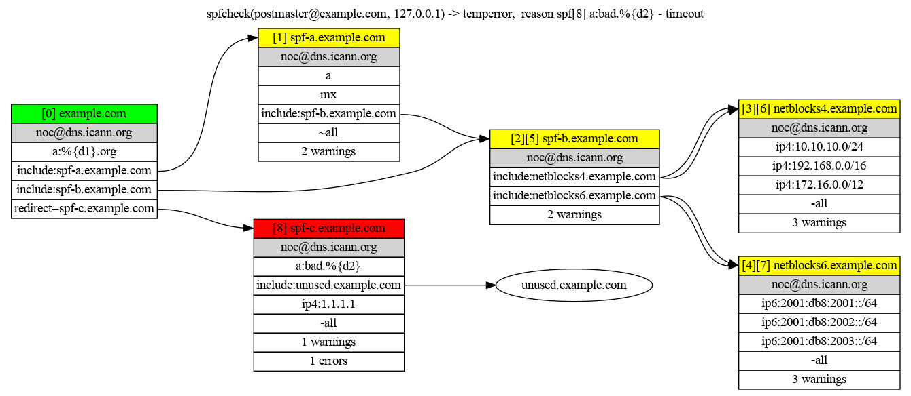

# Spfcheck


[](https://github.com/hertogp/spfcheck/actions/workflows/elixir.yml)
[](https://hex.pm/packages/spfcheck)
[](https://hexdocs.pm/spfcheck/)
[](https://github.com/hertogp/spfcheck/commits/main)
[](https://github.com/hertogp/spfcheck/blob/main/LICENSE.md)
[](https://hex.pm/packages/spfcheck)

<!-- @MODULEDOC -->

`spfcheck` is a command line tool to examine and debug SPF records.

Maintaining SPF records as part of your email security can quickly become
cumbersome, especially when there is a need to include SPF records across
administrative boundaries.

Use `spfcheck` to:
- debug an existing policy
- test new SPF records before publishing in DNS
- generate a report for an SPF policy
- visualize an SPF policy
- generate a csv-file with policy evaluation results for lots of domains

`spfcheck` passes the
[`rfc7208`](https://www.rfc-editor.org/rfc/rfc7208.html)
[`test suite`](http://www.open-spf.org/Test_Suite) and should be reasonably rfc
compliant.


## Usage

```txt
Usage: spfcheck [options] [sender ...]

where sender = [localpart@]domain and localpart defaults to 'postmaster'

Options:
  -H, --help              print this message and exit
  -a, --author=string     sets author in the markdown metadata (default spfcheck)
  -c, --color             use color for log messages on stderr (default is true)
  -d, --dns=filepath      file with DNS RR records to prepopulate the DNS cache
  -h, --helo=string       sending MTA helo/ehlo identity (defaults to nil)
  -i, --ip=string         sending MTA IPv4/IPv6 address (defaults to 127.0.0.1)
  -m, --markdown          use markdown format for output (default depends, see Report flag)
  -n, --nameserver=string an IPv4/IPv6 address of a nameserver to use
  -r, --report=string     either "all" or one of more letters of "vgsewpdat" (see below)
  -t, --title=string      sets title in the markdown metadata (default "SPF report")
  -v, --verbosity=number  set logging noise level (0..5), default is 4 (informational)
  -w, --width=NUM         limits line length to increase readability (defaults to 60)
  and
  --no-color              turn off colors for log messages
  --no-markdown           turn off markdown formatting for reports
```

The default is to simply print the verdict and some stats to stdout and print
notification messages to stderr.


```txt
% spfcheck example.com --no-color

example.com %spf[0]-ctx-info:   > sender is 'example.com'
example.com %spf[0]-ctx-info:   > local part set to 'postmaster'
example.com %spf[0]-ctx-info:   > domain part set to 'example.com'
example.com %spf[0]-ctx-info:   > helo set to 'example.com'
example.com %spf[0]-ctx-info:   > ip set to '127.0.0.1'
example.com %spf[0]-ctx-info:   > DNS cache preloaded with 0 entrie(s)
example.com %spf[0]-ctx-info:   > verbosity level 4
example.com %spf[0]-ctx-info:   > created context for 'example.com'
example.com %spf[0]-spf-note:   > spfcheck(example.com, 127.0.0.1, example.com)
example.com %spf[0]-dns-info:   > DNS QUERY (1) txt example.com - ["v=spf1 -all", "yxvy9m4blrswgrsz8ndjh467n2y7mgl2"]
example.com %spf[0]-eval-note:  > spf[0] -all - matches
example.com %spf[0]-dns-info:   > DNS QUERY (2) soa example.com - [{"ns.icann.org", "noc.dns.icann.org", 2021120707, 7200, 3600, 1209600, 3600}]

domain     : example.com
ip         : 127.0.0.1
sender     : example.com
verdict    : fail
reason     : spf[0] -all
owner      : example.com
contact    : noc@dns.icann.org
num_spf    : 1
num_dnsm   : 0
num_dnsq   : 1
num_dnsv   : 0
num_checks : 1
num_warn   : 0
num_error  : 0
duration   : 0
explanation: 
```


## Batchmode

If no `sender` is given on the command line, `spfcheck` will read stdin for the
domains (and options) to check.  In this case, the verdict(s) are output on
stdout in csv-format as each domain is (sequentially) evaluated.

```txt
% cat assets/domains.txt
example.com
me@example.net -i 1.2.3.4

% cat assets/domains.txt | spfcheck -v 0
domain,ip,sender,verdict,reason,owner,contact,num_spf,num_dnsm,num_dnsq,num_dnsv,num_checks,num_warn,num_error,duration,explanation
"example.com","127.0.0.1","example.com",:fail,"spf[0] -all","example.com","noc@dns.icann.org",1,0,1,0,1,0,0,1,""
"example.net","1.2.3.4","me@example.net",:fail,"spf[0] -all","example.net","noc@dns.icann.org",1,0,1,0,1,0,0,0,""
```

## DNS flag

The `-d` flag can be used to either point to local file with RR-records or
specify DNS data on the command line.  If the file exists, it is read and used
to prepopulate the cache. Otherwise, the text will be read as DNS data.  This
makes it possible to try out records before publishing them in DNS.  That file
should contain 1 RR record per line using:
- `domain type rdata`
- `domain type error`

Where:
- `type` should be one of `A`, `AAAA`, `CNAME`, `MX`, `NS`, `PTR`, `SOA`, `SPF` or `TXT`, and
- `error` should be one of `FORMERR`, `NXDOMAIN`, `SERVFAIL`, `TIMEOUT` or `ZERO_ANSWERS`

The DNS `type` and `error` are both are case-insensitive and all domains are
taken relative to root ('.') which is always stripped if present.  In case of
any errors, the resource record is ignored and a warning logged.

For the curious, the RR-type `SPF` is a relic from the past and only used when
generating the ExUnit test files for the rfc7208 testsuite during development.
It is not used by `spfcheck` when evaluating an SPF policy.  The same holds
true for the RR-types `NS` and `SOA`, but the latter does allow for
manipulating the verdict's owner and/or the DNS reporting, if applicable.

```txt
% spfcheck example.com -v 0 -d "example.com TXT v=spf1 +all"

domain     : example.com
ip         : 127.0.0.1
sender     : example.com
verdict    : pass
reason     : spf[0] +all
owner      : example.com
contact    : noc@dns.icann.org
num_spf    : 1
num_dnsm   : 0
num_dnsq   : 1
num_dnsv   : 0
num_checks : 1
num_warn   : 1
num_error  : 0
duration   : 0
explanation:


# Or using a file

% cat assets/zonedata.txt
# comments are ignored as are empty lines

example.com TXT v=spf1 -all exp=why.%{d}
example.com TXT just another txt record
why.example.com TXT %{d}: %{i} is not one of our MTA's

% spfcheck example.com -v 0 -d assets/zonedata.txt

domain     : example.com
ip         : 127.0.0.1
sender     : example.com
verdict    : fail
reason     : spf[0] -all
owner      : example.com
contact    : noc@dns.icann.org
num_spf    : 1
num_dnsm   : 0
num_dnsq   : 2
num_dnsv   : 0
num_checks : 1
num_warn   : 0
num_error  : 0
duration   : 1
explanation: example.com: 127.0.0.1 is not one of our MTA's
```

`spfcheck` counts the number of dns mechanisms seen (dnsm), the number of
queries performed (dnsq) and the number of void dns queries seen (dnsv).
If the evaluation took more than `10` dns mechanisms or saw more than `2`
void DNS lookups, the verdict is modified accordingly.  The soa queries
used to retrieve/find the owner and contact information are not included
in the dns counters.

## Helo flag

The `-h` allows for setting the EHLO domain name and defaults to given
`sender`.  Note that `spfcheck` only checks SPF for `sender`, so this is only
useful when checking the expansion of the `%{h}`-macro in a policy.

## Ip flag

The `-i` flag is used to set sender's IP to either an IPv4 or an IPv6 address,
it defaults to `127.0.0.1` as an unlikely address to be authorized by anyone.
The goal is to go down the rabbit hole as far as possible and check the entire
nested SPF policy for given `sender`.  Notes:
- if given an IPv4-mapped IPv6 address, the IPv4 address is extracted and used
- if given an invalid IP address, it defaults to 127.0.0.1
- the given IP may also be a prefix rather than a full address

```txt
% spfcheck example.com --no-color -i "::ffff:1.2.3.4"
example.com %spf[0]-ctx-info:   > sender is 'example.com'
example.com %spf[0]-ctx-info:   > local part set to 'postmaster'
example.com %spf[0]-ctx-info:   > domain part set to 'example.com'
example.com %spf[0]-ctx-info:   > ip is '1.2.3.4'
example.com %spf[0]-ctx-note:   > '1.2.3.4' was extracted from IPv4-mapped IPv6 address '::ffff:1.2.3.4'
example.com %spf[0]-ctx-info:   > helo set to 'example.com'
example.com %spf[0]-ctx-info:   > DNS cache preloaded with 0 entrie(s)
example.com %spf[0]-ctx-info:   > verbosity level 4
example.com %spf[0]-ctx-info:   > created context for 'example.com'
example.com %spf[0]-spf-note:   > spfcheck(example.com, 1.2.3.4, example.com)
example.com %spf[0]-dns-info:   > DNS QUERY (1) txt example.com - ["8j5nfqld20zpcyr8xjw0ydcfq9rk8hgm", "v=spf1 -all"]
example.com %spf[0]-eval-note:  > spf[0] -all - matches
example.com %spf[0]-dns-info:   > DNS QUERY (2) soa example.com - [{"ns.icann.org", "noc.dns.icann.org", 2021111701, 7200, 3600, 1209600, 3600}]

domain     : example.com
ip         : 1.2.3.4
sender     : example.com
verdict    : fail
reason     : spf[0] -all
owner      : example.com
contact    : noc@dns.icann.org
num_spf    : 1
num_dnsm   : 0
num_dnsq   : 1
num_dnsv   : 0
num_checks : 1
num_warn   : 0
num_error  : 0
duration   : 0
explanation:

# or check for some prefix

% spfcheck example.com -i 1.1.255.0/24 -d "example.com txt v=spf1 ip4:1.1.0.0/16 -all" --no-color
example.com %spf[0]-ctx-info:   > sender is 'example.com'
example.com %spf[0]-ctx-info:   > local part set to 'postmaster'
example.com %spf[0]-ctx-info:   > domain part set to 'example.com'
example.com %spf[0]-ctx-info:   > ip is '1.1.255.0/24'
example.com %spf[0]-ctx-info:   > helo set to 'example.com'
example.com %spf[0]-ctx-info:   > DNS cache preloaded with 1 entrie(s)
example.com %spf[0]-ctx-info:   > verbosity level 4
example.com %spf[0]-ctx-info:   > created context for 'example.com'
example.com %spf[0]-spf-note:   > spfcheck(example.com, 1.1.255.0/24, example.com)
example.com %spf[0]-dns-info:   > DNS QUERY (1) [cache] txt example.com - ["v=spf1 ip4:1.1.0.0/16 -all"]
example.com %spf[0]-eval-note:  > spf[0] ip4:1.1.0.0/16 - matches 1.1.255.0/24
example.com %spf[0]-dns-info:   > DNS QUERY (2) soa example.com - [{"ns.icann.org", "noc.dns.icann.org", 2021111701, 7200, 3600, 1209600, 3600}]

domain     : example.com
ip         : 1.1.255.0/24
sender     : example.com
verdict    : pass
reason     : spf[0] ip4:1.1.0.0/16
owner      : example.com
contact    : noc@dns.icann.org
num_spf    : 1
num_dnsm   : 0
num_dnsq   : 1
num_dnsv   : 0
num_checks : 1
num_warn   : 0
num_error  : 0
duration   : 0
explanation: 
```

## Nameserver flag

Use `-n ip` or `--nameserver ip` to specify an IPv4 or IPv6 address of a,
possibly external, recursive nameserver to use for an SPF policy evaluation
instead of using the system default settings.  Specify multiple nameservers
by repeating the option with different IP addresses, in which case they will be
tried in the order listed.

```txt
% spfcheck example.com -n 2001:4860:4860::8888 -v 5 --no-color

example.com %spf[0]-ctx-info:   > sender is 'example.com'
example.com %spf[0]-ctx-info:   > local part set to 'postmaster'
example.com %spf[0]-ctx-info:   > domain part set to 'example.com'
example.com %spf[0]-ctx-info:   > ip set to '127.0.0.1'
example.com %spf[0]-ctx-debug:  > atype set to 'a'
example.com %spf[0]-ctx-info:   > helo set to 'example.com'
example.com %spf[0]-ctx-debug:  > helo defaults to sender value
example.com %spf[0]-ctx-info:   > DNS cache preloaded with 0 entrie(s)
example.com %spf[0]-ctx-info:   > verbosity level 5
example.com %spf[0]-ctx-debug:  > DNS timeout set to 2000
example.com %spf[0]-ctx-debug:  > max DNS mechanisms set to 10
example.com %spf[0]-ctx-debug:  > max void DNS lookups set to 2
example.com %spf[0]-ctx-debug:  > verdict defaults to 'neutral'
example.com %spf[0]-ctx-debug:  > nameservers set to [{{8193, 18528, 18528, 0, 0, 0, 0, 34952}, 53}]
example.com %spf[0]-ctx-info:   > created context for 'example.com'
example.com %spf[0]-spf-note:   > spfcheck(example.com, 127.0.0.1, example.com)
example.com %spf[0]-dns-debug:  > added {example.com, txt} -> "v=spf1 -all"
example.com %spf[0]-dns-debug:  > added {example.com, txt} -> "8j5nfqld20zpcyr8xjw0ydcfq9rk8hgm"
example.com %spf[0]-dns-info:   > DNS QUERY (1) txt example.com - ["8j5nfqld20zpcyr8xjw0ydcfq9rk8hgm", "v=spf1 -all"]
example.com %spf[0]-eval-note:  > spf[0] -all - matches
example.com %spf[0]-dns-debug:  > added {example.com, soa} -> {"ns.icann.org", "noc.dns.icann.org", 2021111701, 7200, 3600, 1209600, 3600}
example.com %spf[0]-dns-info:   > DNS QUERY (2) soa example.com - [{"ns.icann.org", "noc.dns.icann.org", 2021111701, 7200, 3600, 1209600, 3600}]

domain     : example.com
ip         : 127.0.0.1
sender     : example.com
verdict    : fail
reason     : spf[0] -all
owner      : example.com
contact    : noc@dns.icann.org
num_spf    : 1
num_dnsm   : 0
num_dnsq   : 1
num_dnsv   : 0
num_checks : 1
num_warn   : 0
num_error  : 0
duration   : 0
explanation:
```


## No color flag

The `--no-color` flag disables the use of colors in log messages, which is
better when redirecting logging to a file.

For example:

```txt
%cat assets/domains.txt
example.com
me@example.net -i 1.2.3.4

% cat assets/domains.txt | spfcheck -v 5 --no-color 2>assets/log.txt >assets/checked.csv
% cat assets/log.txt
example.com %spf[0]-ctx-info:   > sender is 'example.com'
example.com %spf[0]-ctx-info:   > local part set to 'postmaster'
example.com %spf[0]-ctx-info:   > domain part set to 'example.com'
example.com %spf[0]-ctx-info:   > ip set to '127.0.0.1'
example.com %spf[0]-ctx-debug:  > atype set to 'a'
example.com %spf[0]-ctx-info:   > helo set to 'example.com'
example.com %spf[0]-ctx-debug:  > helo defaults to sender value
example.com %spf[0]-ctx-info:   > DNS cache preloaded with 0 entrie(s)
example.com %spf[0]-ctx-info:   > verbosity level 5
example.com %spf[0]-ctx-debug:  > DNS timeout set to 2000
example.com %spf[0]-ctx-debug:  > max DNS mechanisms set to 10
example.com %spf[0]-ctx-debug:  > max void DNS lookups set to 2
example.com %spf[0]-ctx-debug:  > verdict defaults to 'neutral'
example.com %spf[0]-ctx-debug:  > nameservers set to default
example.com %spf[0]-ctx-info:   > created context for 'example.com'
example.com %spf[0]-spf-note:   > spfcheck(example.com, 127.0.0.1, example.com)
example.com %spf[0]-dns-debug:  > added {example.com, txt} -> "v=spf1 -all"
example.com %spf[0]-dns-debug:  > added {example.com, txt} -> "8j5nfqld20zpcyr8xjw0ydcfq9rk8hgm"
example.com %spf[0]-dns-info:   > DNS QUERY (1) txt example.com - ["8j5nfqld20zpcyr8xjw0ydcfq9rk8hgm", "v=spf1 -all"]
example.com %spf[0]-eval-note:  > spf[0] -all - matches
example.com %spf[0]-dns-debug:  > added {example.com, soa} -> {"ns.icann.org", "noc.dns.icann.org", 2021111701, 7200, 3600, 1209600, 3600}
example.com %spf[0]-dns-info:   > DNS QUERY (2) soa example.com - [{"ns.icann.org", "noc.dns.icann.org", 2021111701, 7200, 3600, 1209600, 3600}]
example.net %spf[0]-ctx-info:   > sender is 'me@example.net'
example.net %spf[0]-ctx-info:   > local part set to 'me'
example.net %spf[0]-ctx-info:   > domain part set to 'example.net'
example.net %spf[0]-ctx-info:   > ip set to '1.2.3.4'
example.net %spf[0]-ctx-debug:  > atype set to 'a'
example.net %spf[0]-ctx-info:   > helo set to 'me@example.net'
example.net %spf[0]-ctx-debug:  > helo defaults to sender value
example.net %spf[0]-ctx-info:   > DNS cache preloaded with 0 entrie(s)
example.net %spf[0]-ctx-info:   > verbosity level 5
example.net %spf[0]-ctx-debug:  > DNS timeout set to 2000
example.net %spf[0]-ctx-debug:  > max DNS mechanisms set to 10
example.net %spf[0]-ctx-debug:  > max void DNS lookups set to 2
example.net %spf[0]-ctx-debug:  > verdict defaults to 'neutral'
example.net %spf[0]-ctx-debug:  > nameservers set to default
example.net %spf[0]-ctx-info:   > created context for 'example.net'
example.net %spf[0]-spf-note:   > spfcheck(example.net, 1.2.3.4, me@example.net)
example.net %spf[0]-dns-debug:  > added {example.net, txt} -> "v=spf1 -all"
example.net %spf[0]-dns-debug:  > added {example.net, txt} -> "5fpl1ghm7scnth0907z0pft8c79lvc8t"
example.net %spf[0]-dns-info:   > DNS QUERY (1) txt example.net - ["5fpl1ghm7scnth0907z0pft8c79lvc8t", "v=spf1 -all"]
example.net %spf[0]-eval-note:  > spf[0] -all - matches
example.net %spf[0]-dns-debug:  > added {example.net, soa} -> {"ns.icann.org", "noc.dns.icann.org", 2021111701, 7200, 3600, 1209600, 3600}
example.net %spf[0]-dns-info:   > DNS QUERY (2) soa example.net - [{"ns.icann.org", "noc.dns.icann.org", 2021111701, 7200, 3600, 1209600, 3600}]
```

## Report flag

The `-r` flag can be used to print out some information, topics include:
- `v` the verdict and some statistics
- `g` a graphviz representation of the SPF policy
- `s` the spf records seen and their authority information
- `e` the errors seen
- `w` the warnings seen
- `p` the prefixes collected
- `d` DNS information collected
- `a` the AST for the (first) SPF record
- `t` the tokens for the (last) SPF record seen

In case no `-r` flag is used, spfcheck will simply print out the verdict
without any markdown formatting.  If only one topic is to be reported, the
default is to omit markdown formatting as well unless requested explicitly with
the `-m` flag.

```txt
% spfcheck example.com example.net example.org -v 0 -r s

[0] example.com -- (example.com, noc@dns.icann.org)
    v=spf1 -all

[0] example.net -- (example.net, noc@dns.icann.org)
    v=spf1 -all

[0] example.org -- (example.org, noc@dns.icann.org)
    v=spf1 -all
```

Alternatively, a simple markdown report can be generated.  Use the `-t` and
`-a` flags to customize the title and author information respectively.
The report below shows the SPF records used by several example domains.  If
they had included other SPF records, those would show as well.

````txt
% spfcheck example.com example.net example.org -v 0 -r s -m \
  -t "Spf records used by Example domains" -a mail@example.com

    ---
    title: Spf records used by Example domains
    author: mail@example.com
    date: 2021-11-28 12:44:30
    ...


    # example.com

    ## SPF

    ```
    [0] example.com -- (example.com, noc@dns.icann.org)
        v=spf1 -all

    ```

    # example.net

    ## SPF

    ```
    [0] example.net -- (example.net, noc@dns.icann.org)
        v=spf1 -all

    ```

    # example.org

    ## SPF

    ```
    [0] example.org -- (example.org, noc@dns.icann.org)
        v=spf1 -all

    ```
````

Use the `g` report topic to visualize a domain's SPF policy as a graphviz directed
graph.  If markdown is active, the fenced codeblock will have `graphviz` as its
class, allowing the conversion of the markdown to e.g. a pdf with a picture of
the SPF policy using pandoc and a graphviz filter.


```txt
# example of an SPF policy with some problems
% cat assets/example.db
example.com txt v=spf1 a:%{d1}.org include:spf-a.example.com include:spf-b.example.com redirect=spf-c.example.com
example.org a 1.2.3.4
spf-a.example.com txt v=spf1 a mx include:spf-b.example.com ~all
spf-b.example.com txt v=spf1 include:netblocks4.example.com include:netblocks6.example.com
netblocks4.example.com txt v=spf1 ip4:10.10.10.0/24 ip4:192.168.0.0/16 ip4:172.16.0.0/12 -all
netblocks6.example.com txt v=spf1 ip6:2001:db8:2001::/64 ip6:2001:db8:2002::/64 ip6:2001:db8:2003::/64 -all
spf-c.example.com txt v=spf1 a:bad.%{d2} include:unused.example.com ip4:1.1.1.1 -all
bad.example.com a TIMEOUT
unused.example.com TXT v=spf1 all

% spfcheck example.com --no-color -v 2 -d assets/example.db -r g 2>assets/example.com.log >assets/example.com.dot
% dot -Tpng -O assets/example.com.dot

% cat assets/example.com.log
example.com %spf[1]-dns-warn:   | > DNS QUERY (4) a spf-a.example.com - NXDOMAIN
example.com %spf[1]-dns-warn:   | > DNS QUERY (5) mx spf-a.example.com - NXDOMAIN
example.com %spf[2]-parse-warn: | | > spf[2] spf-b.example.com - has implicit end (?all)
example.com %spf[5]-parse-warn: | > spf[5] spf-b.example.com - has implicit end (?all)
example.com %spf[6]-ipt-warn:   | | > spf[6] ip4:10.10.10.0/24 - redundant entry, already have: spf[3] ip4:10.10.10.0/24
example.com %spf[6]-ipt-warn:   | | > spf[6] ip4:192.168.0.0/16 - redundant entry, already have: spf[3] ip4:192.168.0.0/16
example.com %spf[6]-ipt-warn:   | | > spf[6] ip4:172.16.0.0/12 - redundant entry, already have: spf[3] ip4:172.16.0.0/12
example.com %spf[7]-ipt-warn:   | | > spf[7] ip6:2001:db8:2001::/64 - redundant entry, already have: spf[4] ip6:2001:db8:2001::/64
example.com %spf[7]-ipt-warn:   | | > spf[7] ip6:2001:db8:2002::/64 - redundant entry, already have: spf[4] ip6:2001:db8:2002::/64
example.com %spf[7]-ipt-warn:   | | > spf[7] ip6:2001:db8:2003::/64 - redundant entry, already have: spf[4] ip6:2001:db8:2003::/64
example.com %spf[8]-dns-warn:   > DNS QUERY (13) [cache] a bad.example.com - :TIMEOUT
example.com %spf[8]-eval-error: > spf[8] a:bad.%{d2} - timeout
example.com %spf[8]-dns-warn:   > DNS QUERY (14) soa spf-c.example.com - NXDOMAIN
```



A few notes on interpretation:
- the check, verdict and reason are on top of the picture
- the `v=spf1` is never listed since it is not part of the SPF record's AST
- the `exp=` modifier is never listed, just the AST per SPF record seen
- terms with syntax errors are also not listed, but the verdict shows the last erronouos term
- green means an SPF record itself had no errors nor warnings during parsing and evaluation
- yellow means at least 1 warning
- red means at least 1 error
- the `[n]` means it was the `nth` SPF record that was evaluated
- multiple `[m][n]..` means the SPF record was evaluated multiple times
- not all errors are fatal, e.g. a DNS timeout causing a temperror
- `spf-b.example.com`'s SPF record:
    - is included twice, hence the double incoming arrows
    - is evaluated twice, once as the second [2] spf record and once as the fifth [5] record
    - the two warnings are from the implicit end which is seen twice
- `netblocks4.example.com` has 3 warnings
    - it is included twice and the second time around the 3 networks are known already
- `netblocks6.example.com` also has 3 warnings, due to the same reason
- `spf-c.example.com` was redirected to by `example.com`
    - `a:bad.%{d2}` failed with `TIMEOUT`, causing a `temperror`
    - thus the terms `include:unused.example.com` and `ip4:1.1.1.1` were not evaluated
    - hence, the SPF contents of the `unused.example.com` was not retrieved
      which is why it is shown by name only
- only the AST's of SPF records required to arrive at a verdict are shown
    - early success or failure, means the graph does not show the full policy
    - to show as much as possible, use e.g. -i `127.0.0.1` (the default) or e.g.
      `0.0.0.0`
- the DNS warnings for the `soa` queries can be ignored
    - the authority is searched by querying for the soa record while dropping front-labels
    - their stats (num_dnsq and/or num_dnsv) are not included in the stats shown in the verdict

## Verbosity flag

The `-v` flag controls the verbosity level of logging on stderr:
- 0 - no messages at all
- 1 - errors
- 2 - warnings
- 3 - notifications
- 4 - informational
- 5 - debug

```txt
% spfcheck example.com -v 2 --no-color -d "example.com txt v=spf1 a -a/24 mx +all"  

example.com %spf[0]-parse-warn: > spf[0] +all - usage not advisable
example.com %spf[0]-parse-warn: > spf[0] +all - default '+' can be omitted
example.com %spf[0]-ipt-warn:   > spf[0] -a/24 - overlaps with more specific spf[0] a
example.com %spf[0]-ipt-warn:   > spf[0] -a/24 - inconsistent with more specific spf[0] a
example.com %spf[0]-eval-warn:  > spf[0] mx - unusable due to null MX for example.com

domain     : example.com
ip         : 127.0.0.1
sender     : example.com
verdict    : pass
reason     : spf[0] +all
owner      : example.com
contact    : noc@dns.icann.org
num_spf    : 1
num_dnsm   : 3
num_dnsq   : 4
num_dnsv   : 0
num_checks : 4
num_warn   : 5
num_error  : 0
duration   : 0
explanation: 

```

## Width flag

Finally, the `-w` flag can be used to control the width used when printing
information of certain topics.  Primarily meant so a markdown formatted report
can be easily converted to pdf.  Default value is 60, but you can make it as
wide as necessary.  This is useful when expirementating with records.

```txt
# normally output is wrapped at 60 columns

% spfcheck -v 0 -r d -d assets/example.db example.com
example.org A 1.2.3.4
com.org A 34.206.39.153
example.com TXT "v=spf1 a:%{d1}.org
    include:spf-a.example.com include:spf-b.example.com
    redirect=spf-c.example.com"
netblocks4.example.com TXT "v=spf1 ip4:10.10.10.0/24
    ip4:192.168.0.0/16 ip4:172.16.0.0/12 -all"
netblocks6.example.com TXT "v=spf1 ip6:2001:db8:2001::/64
    ip6:2001:db8:2002::/64 ip6:2001:db8:2003::/64 -all"
spf-a.example.com A NXDOMAIN
spf-a.example.com MX NXDOMAIN
spf-a.example.com TXT "v=spf1 a mx include:spf-b.example.com
    ~all"
spf-b.example.com TXT "v=spf1 include:netblocks4.example.com
    include:netblocks6.example.com"
spf-c.example.com TXT "v=spf1 a:bad.%{d2}
    include:unused.example.com ip4:1.1.1.1 -all"
bad.example.com A TIMEOUT
unused.example.com TXT "v=spf1 all"
spf-a.example.com A NXDOMAIN
spf-a.example.com MX NXDOMAIN
bad.example.com A TIMEOUT

# If intending to edit the DNS records to experiment, add the -w flag

% spfcheck -v 0 -r d -d assets/example.db -w 300 example.com
example.org A 1.2.3.4
com.org A 34.206.39.153
example.com TXT "v=spf1 a:%{d1}.org include:spf-a.example.com include:spf-b.example.com redirect=spf-c.example.com"
netblocks4.example.com TXT "v=spf1 ip4:10.10.10.0/24 ip4:192.168.0.0/16 ip4:172.16.0.0/12 -all"
netblocks6.example.com TXT "v=spf1 ip6:2001:db8:2001::/64 ip6:2001:db8:2002::/64 ip6:2001:db8:2003::/64 -all"
spf-a.example.com A NXDOMAIN
spf-a.example.com MX NXDOMAIN
spf-a.example.com TXT "v=spf1 a mx include:spf-b.example.com ~all"
spf-b.example.com TXT "v=spf1 include:netblocks4.example.com include:netblocks6.example.com"
spf-c.example.com TXT "v=spf1 a:bad.%{d2} include:unused.example.com ip4:1.1.1.1 -all"
bad.example.com A TIMEOUT
unused.example.com TXT "v=spf1 all"
spf-a.example.com A NXDOMAIN
spf-a.example.com MX NXDOMAIN
bad.example.com A TIMEOUT

```


<!-- @MODULEDOC -->

## Installation

[`spfcheck`](`Spfcheck`) requires Elixir 1.12.0 or later and can be installed as an escript:

```bash
mix escript.install hex spfcheck
```

After installation, `~/.mix/escripts/spfcheck` invokes the escript.

Use the underlying `Spf` modules in a project by adding `spfcheck` to the list of
dependencies in `mix.exs`:

```elixir
def deps do
  [
    {:spfcheck, "~> 0.7.1"}
  ]
end
```
